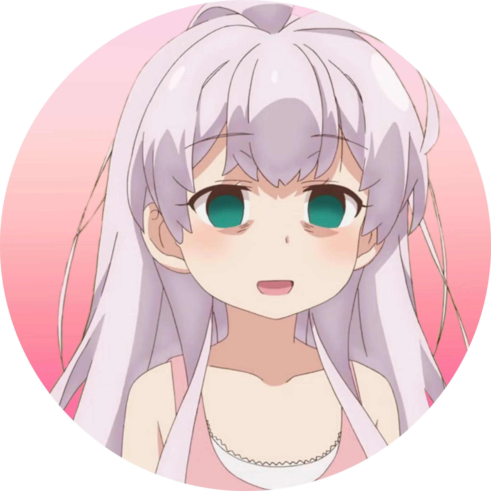

<p align="center"></p>
<hr>

# Nat VPS Installer
Oneclick installer for ssh websocket, xray, vmess, trojan, trojango, shadowsocks

```html
wget https://raw.githubusercontent.com/ozipoetra/Nat-VPS-Installer/main/install-nat.sh && chmod +x install-nat.sh && ./install-nat.sh

```

<b>Note:</b>
* Forward the domain to port 1443 for sslws and 8880 for non ws through Control Panel VPS. If using cloudflare, make sure not Proxied
* For xray and trojango you can done by adding AAAA record with your ipv6 vps and make sure to Proxied through cloudflare, you didn't need to forward the domain.

<b>Credit:</b>
* Sulaiman SL for his awesome script
